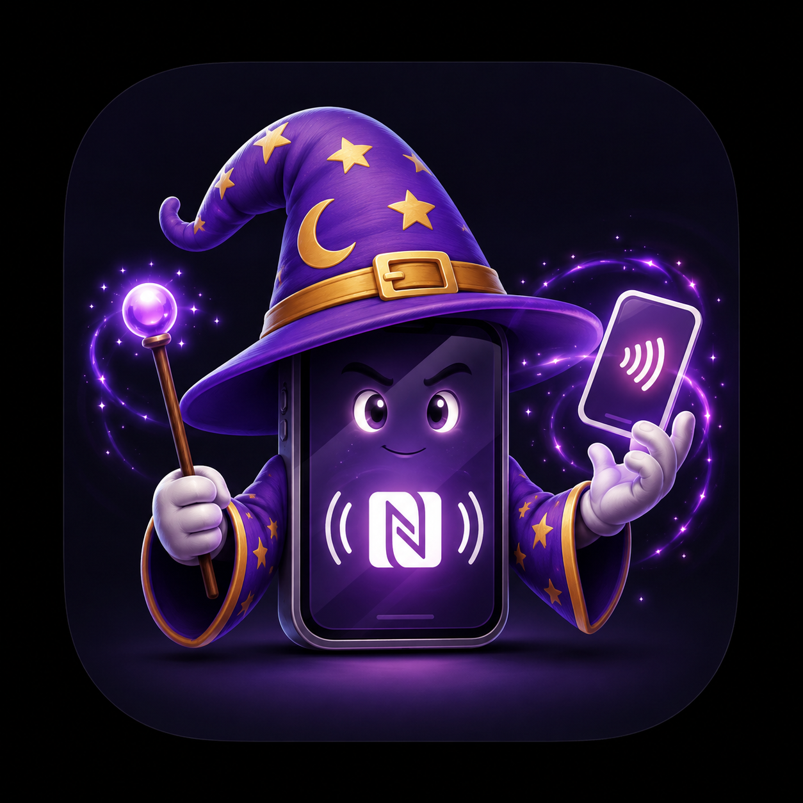

<p align="center">
  
</p>

# NFCromancer

**Use real NFC hardware from the iOS Simulator.**

The iOS Simulator has no NFC: `NFCNDEFReaderSession.readingAvailable` is
false, sessions never begin, and every tap/scan/provisioning flow is
untestable without a device. NFCromancer conjures the dead framework back to
life — transparently bridging CoreNFC from a simulated app to a real USB NFC
reader on the host Mac (ACR122U), or to configurable mock tags.

Third member of the Simsalabim family, after
[ImpossiBLE](https://github.com/mickeyl/ImpossiBLE) and
[CAMouflage](https://github.com/mickeyl/CAMouflage). Same philosophy, same
integration story: add a local Swift package, build, run. No
`DYLD_INSERT_LIBRARIES`, no system extension, no code changes in the app
under test. Built on
[SimBridgeKit](https://github.com/mickeyl/SimBridgeKit) from day one, and
embeddable in the [Simsalabim](https://github.com/mickeyl/Simsalabim) suite
app once released.

> **Status: 0.1.0-dev, phase 0.** The scaffold is functional: the library
> swizzles `readingAvailable` to reflect provider connectivity, and the menu
> bar provider serves the socket with the shared transport (hello handshake,
> takeover, ownership guard). Sessions, ACR122U passthrough, and mock tags
> land phase by phase — see [PLAN.md](PLAN.md).

## Quick Start

```bash
# Build and start the mock menu bar app, then pick a mode in its panel
make mock-run

# In Xcode: add NFCromancer as a local Swift package dependency,
# then build and run your app in the iOS Simulator.
```

## Requirements

- macOS 15+; for passthrough an ACR122U (or CCID-compatible) USB NFC reader
- Xcode 16+ (Swift Package Manager)

## Repository Map

| Path | Contents |
|---|---|
| `Sources/NFCromancer` | Simulator-side library (Objective-C, `NFR` prefix) |
| `Sources/NFCromancer-Mock` | Provider: `NFCromancerProviderKit` + thin menu bar app |
| `PLAN.md` | Full roadmap, verified hardware facts, per-phase status |
| `AGENTS.md` | Architecture invariants, wire protocol, validation recipe |

## License

MIT — see [LICENSE](LICENSE) for details.
